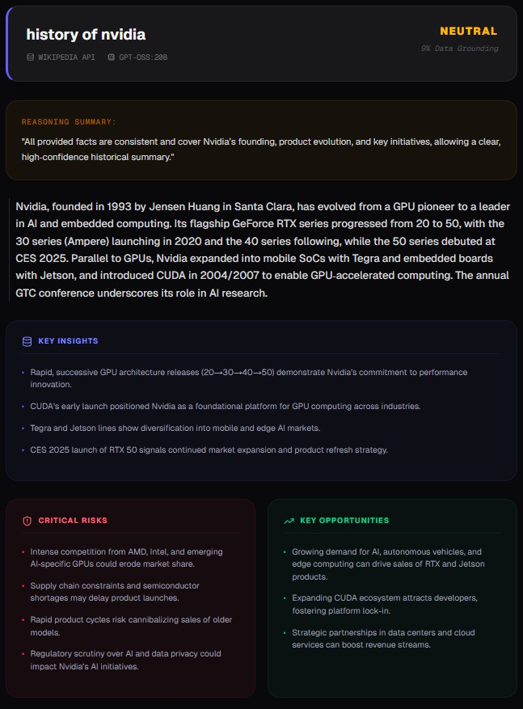
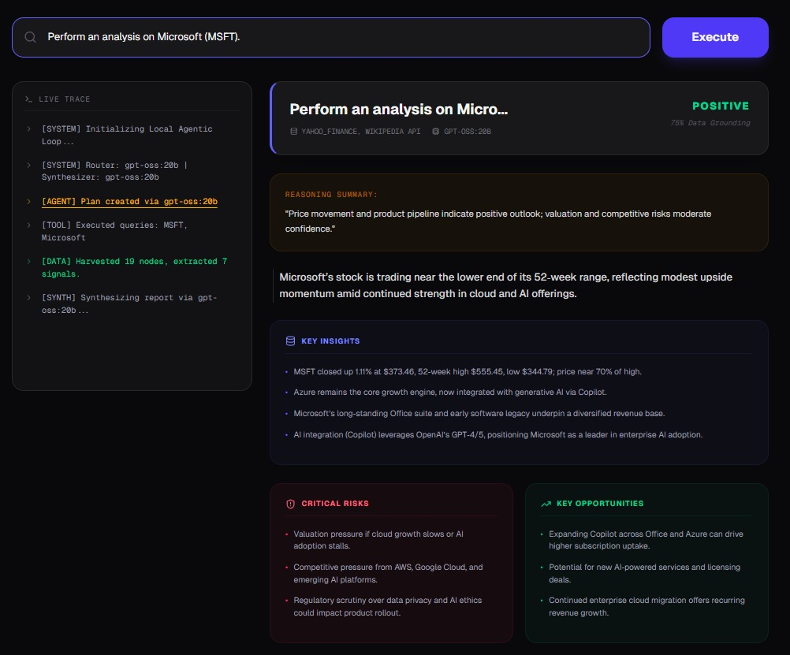

# OpenAgent

AI research agent that fetches real data (Wikipedia + Finance) and outputs structured insights.

---

## What is OpenAgent?

OpenAgent is a multi-step AI agent designed to move beyond basic text generation.

Instead of relying only on model knowledge, it:

* fetches real data from Wikipedia
* pulls market data from Yahoo Finance
* processes everything step-by-step
* returns structured, usable insights

---

## Why this matters

Most AI tools:

* generate text
* rely on model memory
* produce inconsistent outputs

OpenAgent:

* uses real data
* follows a structured pipeline
* produces consistent, structured outputs

---

## How it works

Every query is processed through:

Planning → Execution → Signal Extraction → Synthesis

* Planning: decides which tools to use
* Execution: fetches real data
* Signal Extraction: filters key information
* Synthesis: generates structured output

---

## Example

Prompt:
Analyze Microsoft (MSFT)

Output:

```json
{
  "summary": "...",
  "keyInsights": ["..."],
  "risks": ["..."],
  "opportunities": ["..."],
  "sentiment": "POSITIVE",
  "confidenceScore": 82
}
```

---

## Demo




---

## Requirements

* Node.js (v18+)
* Ollama running locally (http://localhost:11434)

Recommended models:

* gpt-oss:20b (routing)
* gpt-oss:20b (synthesis)

---

## Quick Start

```
npm install
npm run dev
```

Then open:
http://localhost:3000

---

## Use Cases

* Analyze stocks (e.g. MSFT, NVDA)
* Research companies
* Generate structured insights instead of raw text
* Build AI workflows on top of the system

---

## Get the Full Version

https://craigstorm.gumroad.com/l/openagent-research

Includes:

* full working system
* frontend and backend
* structured agent pipeline
* self-healing JSON system (Plumber)
* documentation

---

## Who this is for

* Developers building AI tools
* Hackathon teams
* Engineers exploring agent systems

---

## Note

This is a developer-focused project. Basic familiarity with JavaScript and Node.js is recommended.

---

## Contact

[dsouzacraigmichael@gmail.com](mailto:dsouzacraigmichael@gmail.com)
